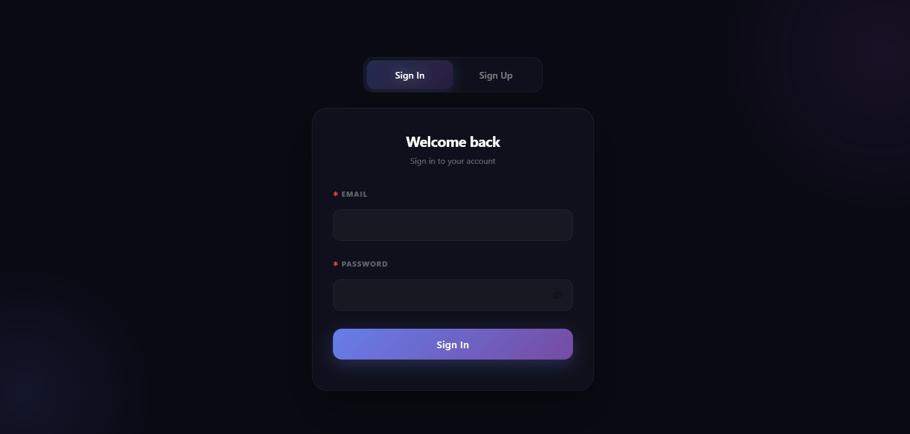
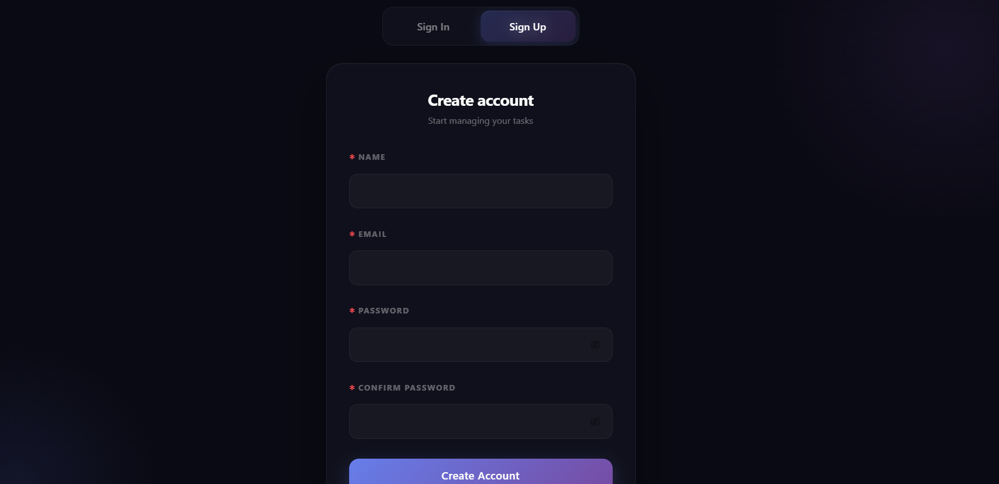
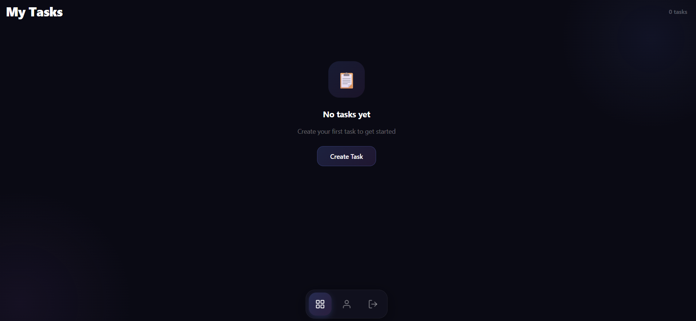
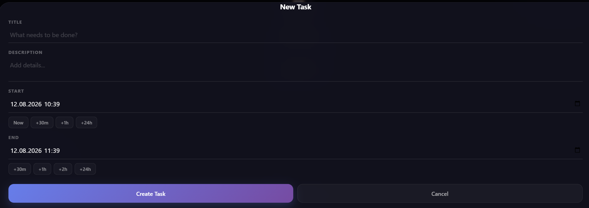
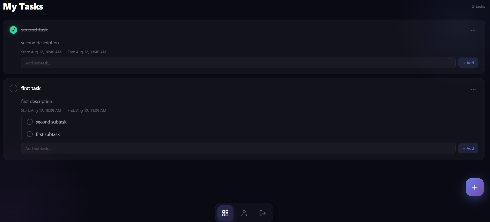
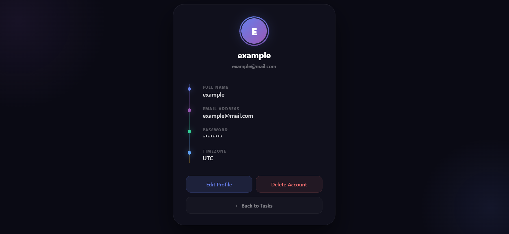

# ToDoApp Frontend
Фронтенд для ToDoApp — приложения для управления задачами.

## Запуск
```bash
npm install
npm start

```
Приложение будет доступно на http://localhost:3000.
Бэкенд должен быть запущен на http://localhost:8080.

## Скриншоты







## Стек
- React
- React Router
- Ant Design
- CSS Modules